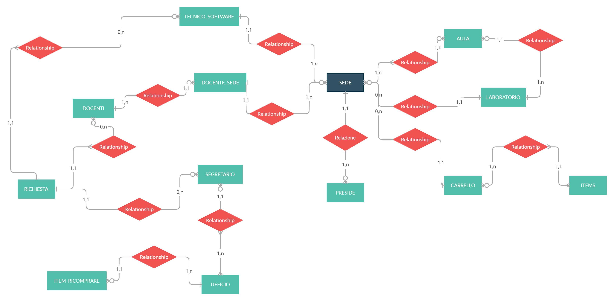

# I tre moschettieri ඞ

* Petar Miloradovic 
* Nicoló Beltrame
* Matteo Mario Pulvirenti 

# DIAGRAMMA ER

# SCHEMA LOGICO

aula(id_aula(pk), fk_sede)  
carrello(id_carrello(pk), fk_sede) 
docente(username(pk), nome, cognome, email, password) 
docente_sede(id_docente sede(pk), fk docenti, fk sede) 
item(id_item(pk), nome, fk_carrello) 
Item_ricomprare(id_item_ricomprare(pk), nome, funzione, prezzo, fk_ufficio_contabilità) 
laboratorio(id_lab(pk), posti, fk_sede, fk_aula) 
preside(username(pk), nome, cognome, email, password) 
richiesta(id_richiesta(pk), data, priorità, descrizione, ambito, luogo, tipologia, status, fk_tecnico, fk_segretario_hardwar, fk_docente) 
sede(id_sede(pk), indirizzo, nome, fk_preside) 
sede_segretario(id_sede_segretario(pk), fk_sede, fk_segretario) 
segretario_hardware(username(pk), nome, cognome, email, password, fk_ufficio) 
tecnico_software(username(pk),nome,cognome,email,password,fk_sede) 
ufficio(id_ufficio(pk))

# RELAZIONE PROGETTO

Il progetto prevede la realizzazione di un sito web per la gestione dell’assistenza informatica di una scuola.Si considera come entità principale una sede, gestita da un unico preside.La sede contiene più aule e alcune di esse sono dei laboratori. Le aule hanno della strumentazione informatica, esse si possono trovare anche nei carrelli (essi non si trovano in una determinata aula). La strumentazione informatica è gestita, per quanto riguarda i problemi software, dai tecnici presenti nella sede (ci possono essere più tecnici nella sede) e per quanto riguarda problemi hardware, che i tecnici non possono risolvere, dall’ufficio contabilità, nel quale lavorano dei segretari (associati ad una o più sedi). All’interno della scuola lavorano docenti che potrebbero riscontrare dei problemi nella strumentazione informatica e che necessitano dell’intervento di un tecnico o segretario, in base alla tipologia del problema. Nel caso un docente riscontri un problema nella strumentazione, deve poter inviare una richiesta di assistenza tramite il sito web, effettuando il login come docente. Una volta entrato nell’area personale la richiesta dovrebbe avere una data di inserimento, un livello di priorità, per capire se è una cosa urgente oppure no ed una descrizione, oltre ad un ambito (esempi sono: problemi con la rete, problema pc aula, problema LIM, problema portatile laboratorio), il luogo dove è richiesto l’intervento e il tipo di intervento (hardware o software). Le richieste dovrebbero arrivare ai tecnici o ai segretari, in base all’ambito della richiesta ed alla sede dove è richiesto l’intervento. I tecnici/segretari devono poter inserire che la richiesta è stata evasa. Dei docenti, segretari e tecnici si vuole sapere il nome , cognome , username , password, email per poter nel caso di problema software o hardware di richiedere o sistemare il problema.

⬜⬜⬜⬜⬜⬜⬜⬜⬜⬜⬜⬜⬜⬜⬜⬜⬜⬜ 
⬜⬜⬜⬜⬜⬜⬜⬛⬛⬛⬛⬛⬛⬜⬜⬜⬜⬜ 
⬜⬜⬜⬜⬜⬜⬛🟥🟥🟥🟥🟥🟥⬛⬜⬜⬜⬜ 
⬜⬜⬜⬜⬜⬛🟥🟥🟥🟥🟥🟥🟥🟥⬛⬜⬜⬜ 
⬜⬜⬜⬜⬜⬛🟥🟥🟥🟥⬛⬛⬛⬛⬛⬛⬜⬜ 
⬜⬜⬜⬜⬛🟥🟥🟥⬛🟦🟦⬜⬜⬜⬜⬛⬜⬜ 
⬜⬜⬜⬜⬛🟥🟥⬛🟪🟦🟦🟦⬜⬜⬜🟦⬛⬜ 
⬜⬜⬛⬛⬛🟥🟥⬛🟪🟦🟦🟦🟦🟦🟦🟦⬛⬜ 
⬜⬛🟥🟥⬛🟥🟥⬛🟪🟪🟪🟦🟦🟦🟦🟪⬛⬜ 
⬜⬛🟥🟥⬛🟥🟥🟥⬛🟪🟪🟪🟪🟪🟪⬛⬜⬜ 
⬜⬛🟥🟥⬛🟥🟥🟥🟥⬛⬛⬛⬛⬛⬛⬛⬜⬜  
⬜⬛🟥🟥⬛🟥🟥🟥🟥🟥🟥🟥🟥🟥🟥⬛⬜⬜ 
⬜⬛🟥🟥⬛🟥🟥🟥🟥🟥🟥🟥🟥🟥🟥⬛⬜⬜ 
⬜⬛🟥🟥⬛🟥🟥🟥🟥🟥🟥🟥🟥🟥🟥⬛⬜⬜ 
⬜⬛🟥🟥⬛🟥🟥🟥🟥🟥🟥🟥🟥🟥🟥⬛⬜⬜ 
⬜⬛🟥🟥⬛🟥🟥🟥🟥🟥🟥🟥🟥🟥🟥⬛⬜⬜ 
⬜⬛🟥🟥⬛🟥🟥🟥🟥🟥🟥🟥🟥🟥🟥⬛⬜⬜ 
⬜⬜⬛⬛⬛🟥🟥🟥🟥🟥🟥🟥🟥🟥🟥⬛⬜⬜ 
⬜⬜⬜⬜⬛🟥🟥🟥⬛⬛⬛⬛🟥🟥🟥⬛⬜⬜ 
⬜⬜⬜⬜⬛🟥🟥🟥⬛⬜⬜⬛🟥🟥🟥⬛⬜⬜ 
⬜⬜⬜⬜⬛🟥🟥🟥⬛⬜⬜⬛🟥🟥🟥⬛⬜⬜ 
⬜⬜⬜⬜⬜⬛⬛⬛⬜⬜⬜⬜⬛⬛⬛⬜⬜⬜ 
⬜⬜⬜⬜⬜⬜⬜⬜⬜⬜⬜⬜⬜⬜⬜⬜⬜⬜ 
